Handin System - UL
===


Program Execution Steps
---
Step 1. Administrator - run ```h4a.py``` file, click _Create New User_ button to create a new user. \
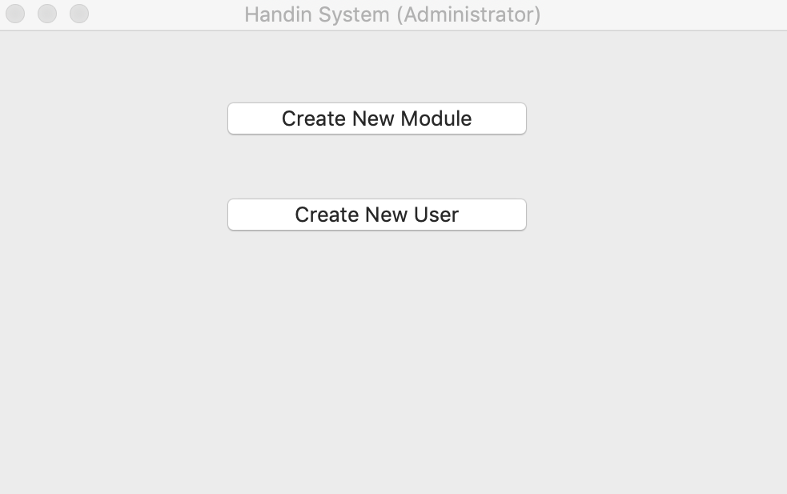

Step 2. Administrator - fill in a username and password for the new user and click Create. \
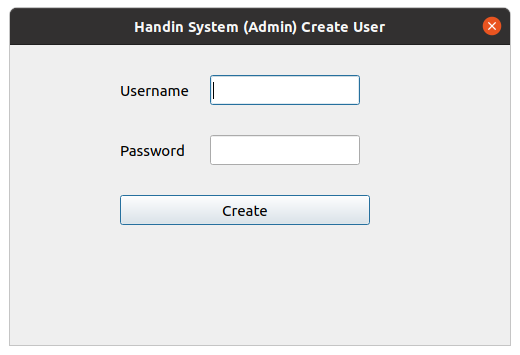

Step 3. Administrator - if its not still running, run ```h4a.py``` file, click _Create New Module_ button to create a new module. \


Step 4. Administrator - fill in the module information and click Ok. \


Step 5. Administrator - go to handin/.handin/access_rights.txt and give the user you created access to the module you created by adding: "<username> <module_code>". \
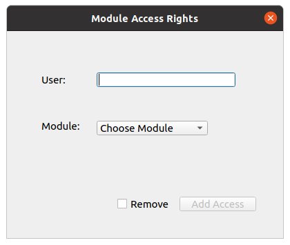
 
Step 6. Lecturer - run ```h4l.py``` and login in with the credentials the administrator set for you. \
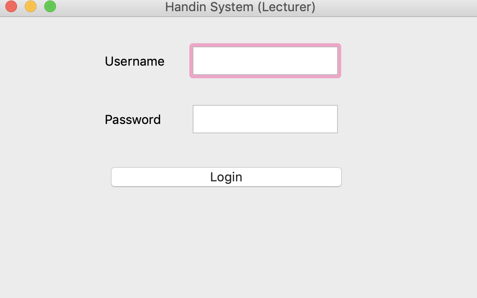

Step 7. Lecturer - once logged in, pick the module you want to work on. Only modules the administrator has given you access rights to will be displayed here. \
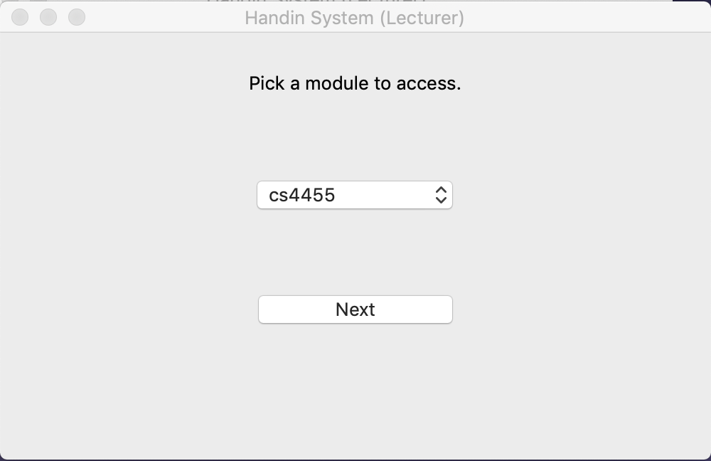

Step 8. Lecturer - once you picked the module you will be presented with the following window that contains all the functions you can carry out on a module. \
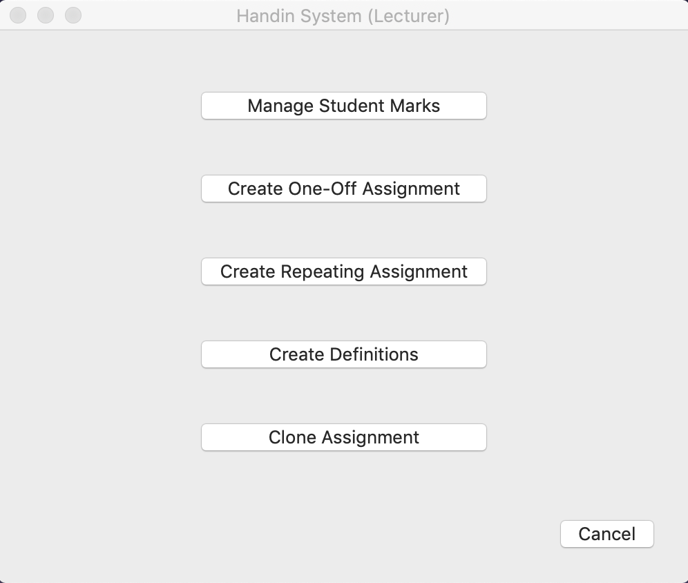

Step 9. (optional) Lecturer - click on the definitions file to set first week date variables so handin can calculate the dates of all the following weeks. You only need to do this once. \
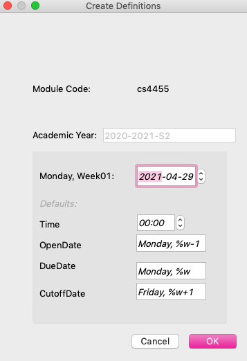

Step 10. Lecturer - there are 3 options to creating an assignment. You can create a one-off assignment, a repeating assignment, or clone an existing assignment if available. \

Step 10.1. Lecturer - to create a one-off assignment click the _Create One-Off Assignment_ button and fill in the blanks in the dialog that pops up then click OK. (The OK button is in a disabled state by default, unless you have completed all the assignment information that needs to be filled in. In addition, some lineedit widgets have a matching rule, for example, only numbers can be filled in the lineedit widget of _Total Attempts_). This creates a params.yaml file that handin will use to correct the student submission. \
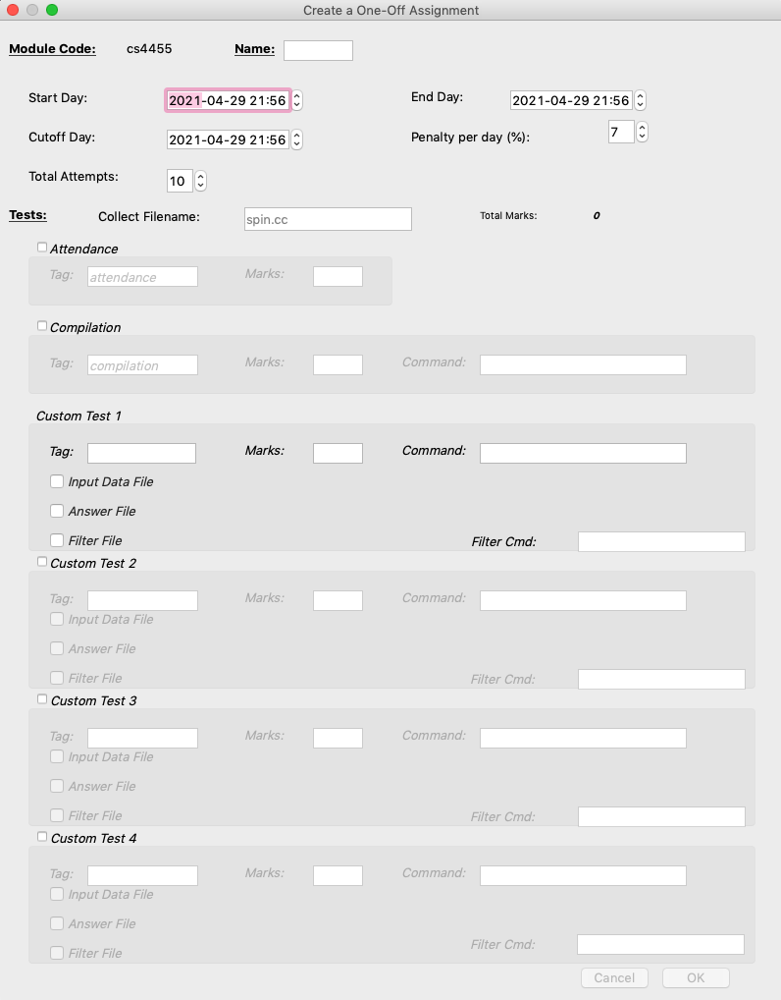

Step 10.2. Lecturer - to create a repeating assignment click the _Create Repeating Assignment_ button and fill in the blanks in the dialog that pops up then click OK. (The OK button is in a disabled state by default, unless you have completed all the assignment information that needs to be filled in. In addition, some lineedit widgets have a matching rule, for example, only numbers can be filled in the lineedit widget of _Total Attempts_). This creates a params.yaml file that handin will use to correct the student submission. \
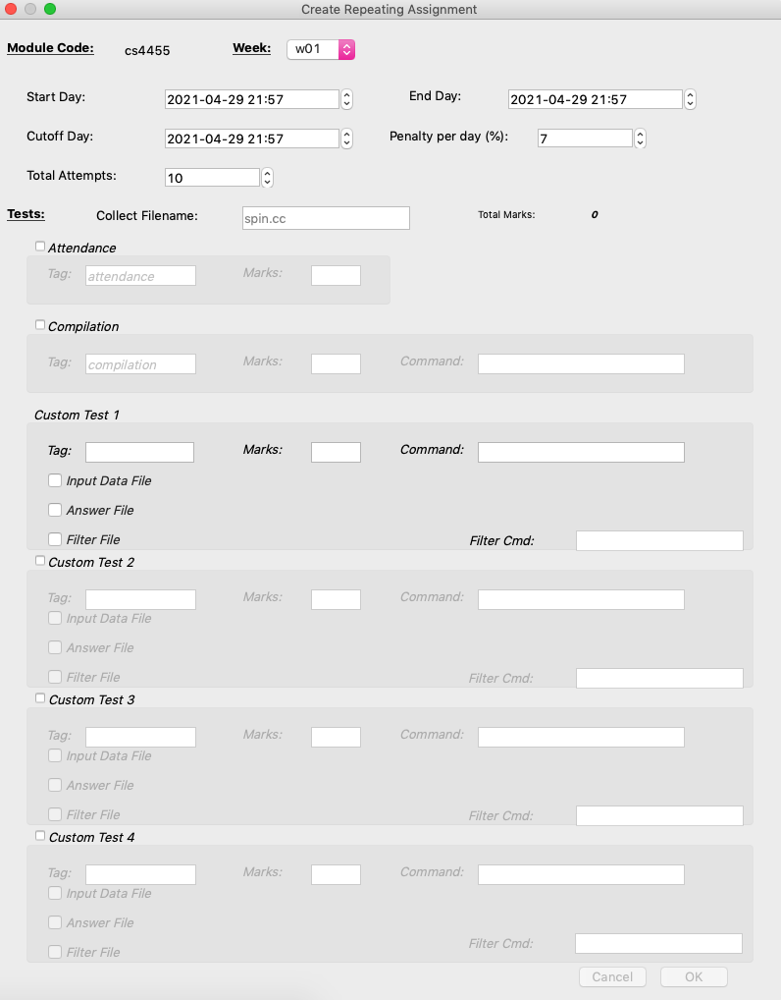

Step 10.3. Lecturer - to clone a previous assignment click the _Clone Assignment_ button and fill in the balnks in the dialog that pops up then click OK. (pick an assignment from the combo box which will only display assignment found for the module you picked earlier, then fill in a name for the new assignment. Click show to display the params file of the assignment your about to clone, tick the "clone this assignment" box to confirm your choice then click OK and the params file will be copied over). \
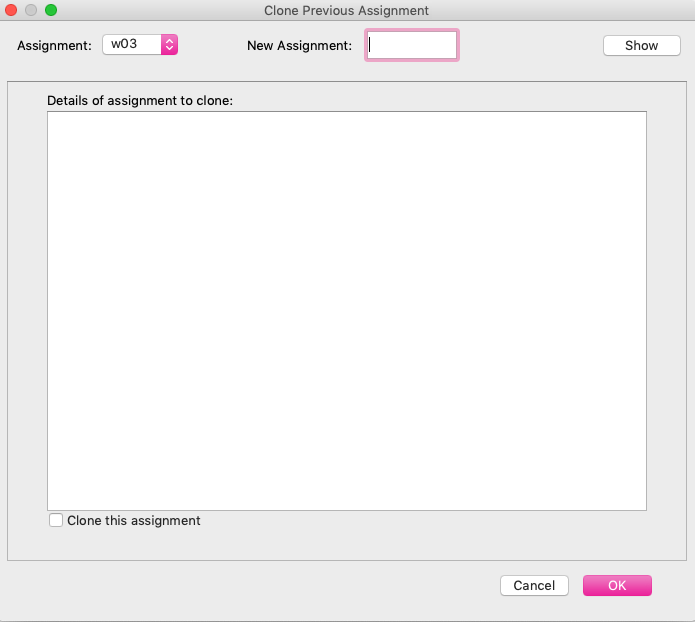

Step 11. Lecturer - in the ```registration_server.py``` file, the module code and name are pre-defined as shown below:
config module code and name here...
MODULE_CODE = "cs4115"
MODULE_NAME = "Default" \

Step 12. Lecturer - start the server for student to download a ```handin.py``` script (submitting code assignments) by running ```registration_server.py```. 
The default host and port number can be found in the ```registration_server.py``` file and are available to be changed: 
HOST = "127.0.0.1"
PORT = 8000 \

Step 13. Student - now the site http://127.0.0.1:8000 is opened for students to provide their student name and ID number, and a link to download the handin.py GUI script will be generated, and students can click the link to get the script file. \
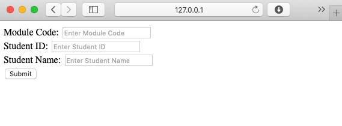

Step 14. Lecturer - Once the students have registered, start handin system server by running `system_server.py`. The default host and port number of system server are initiated in `const.py` by default.
Handin System Server Configs
HANDIN_HOST = '127.0.0.1'
HANDIN_PORT = 5000 \

Step 15. Student - can now submit an assignment by running the handin.py file they downloaded when registering. They can browse through their files and pick the one they want to submit and then click handin. Their results will be displayed in the bottom window. \
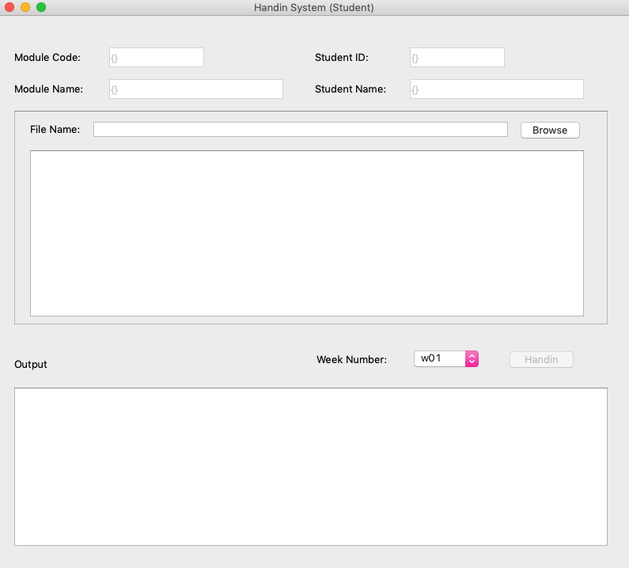

Step 16. Lecturer - can view the students scores and attempts left by click on the _Manage Student Marks_ button. \
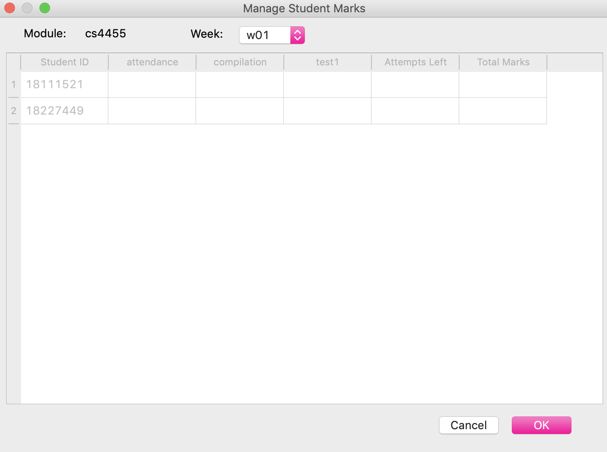

Required Python Modules
---
1. Python 3.x (Student, Lecturer, Admin)
2. PyQt5 (Student, Lecturer, Admin)
3. PyYAML (Lecturer)
4. getmac (Lecturer)
5. passlib (Lecturer, Admin)
