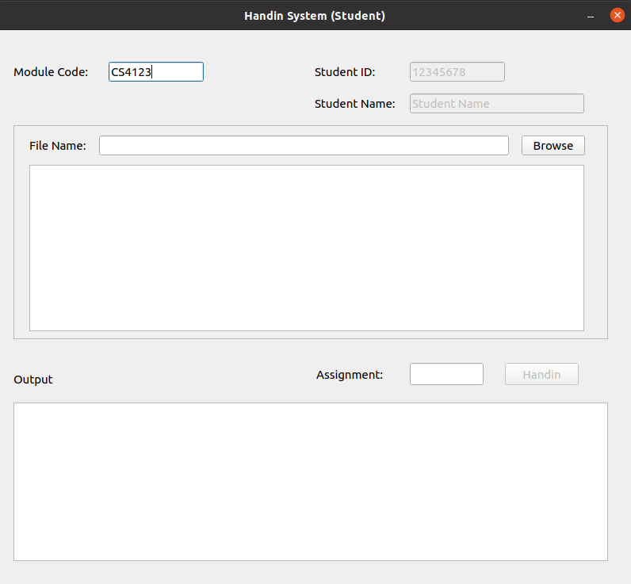
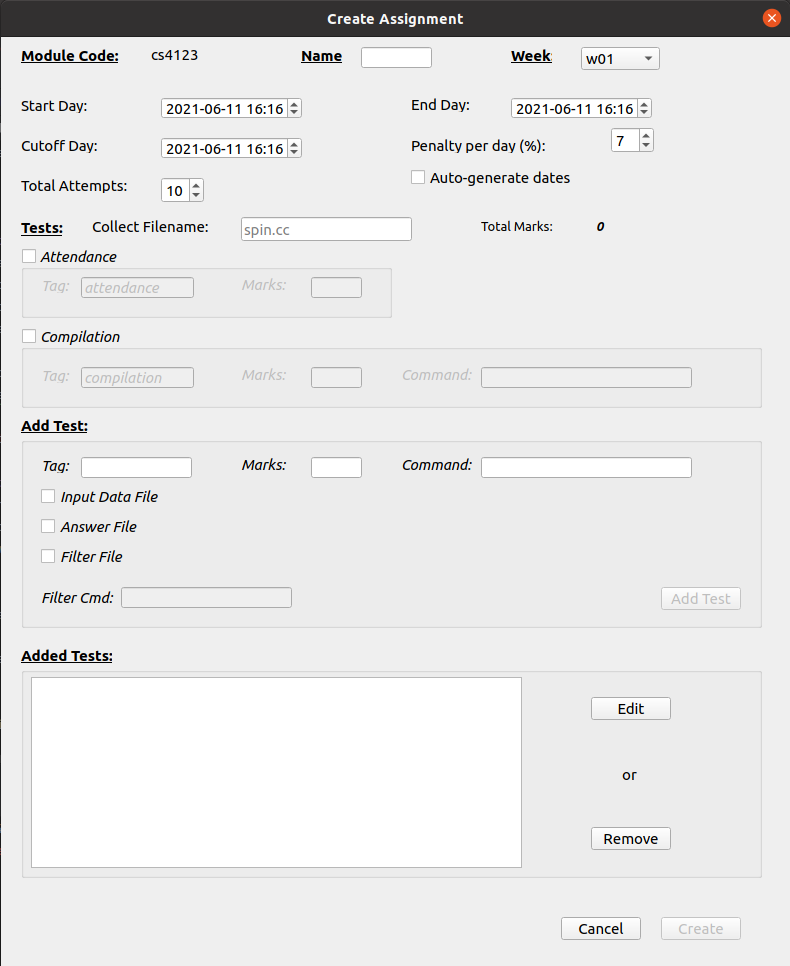
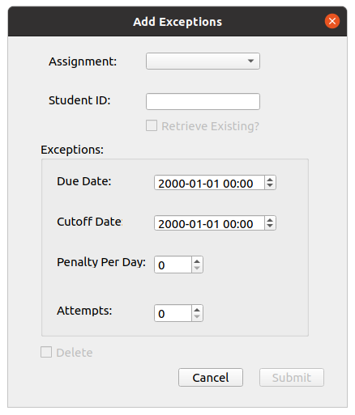
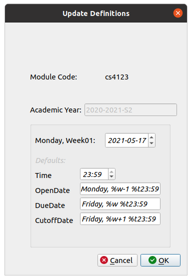
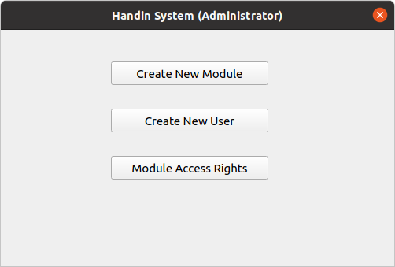
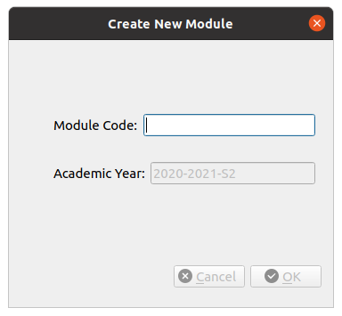

Handin System
===


The handin system allows the setup of multiple modules on which lecturers (or other users like
Teaching Assistant's) can create programming assignments that students can submit code to. Most of
these assignments outline steps of execution (Called "tests") which are automatically executed with
output compared to an "answer" file. The system is composed of many components which each require
separate installation and setup, which will be outlined in this file.

##Requirements
To run the system, you need the following Python dependencies installed on your machine:
- Python 3.x (mostly tested on python 3.9)
- [PyQt5](https://pypi.org/project/PyQt5/) - Version 5.14.1
- [PyYaml](https://pypi.org/project/PyYAML/) - Version 5.1.2
- [epicbox](https://pypi.org/project/epicbox/) - Version 1.1.0 (Only required on the machine running the
  handin system server)

Epicbox is required for docker containerisation of executing a student's submitted code. The system
has only been tested with version 1.1.0, so it is strongly recommended installing that version

The following requirements are for the handin system server and thus are only needed on the machine
running the handin system server:
- docker (Tested on docker version 20.10.6). To install, read the following page: [Docker Installation](https://docs.docker.com/engine/install/)

Make sure the following components get installed with your docker installation: 
- docker-ce
- docker-ce-cli
- containerd.io

### Operating System
The handin system and file servers are intended to be run on a linux machine. The other components like lecturer
scripts are theoretically OS-independent. Linux is still recommended, however

## Installation
To set up the system, you have to follow a few installation steps which will be outlined here. First, you should
grab the code from GitHub by either cloning it to your machine or downloading the zipped code and extracting it.
The directory you clone (or unzip) the repository to will become your HANDINHOME (i.e. the installation directory of the
handin system on that machine)

**Tip:** Add HANDINHOME (absolute path) as an environment variable, so you can easily add it to your path or navigate to
it. (Windows system variable or as a variable in Linux .bashrc). For example, in .bashrc, add the following lines:

```bash
export HANDINHOME="/path/to/handin/installation"
export PATH="$PATH:$HANDINHOME"
```
/path/to/handin/installation = The absolute path to the directory where you cloned or extracted handin to. This directory
should be the root (you should see the src/ directory inside this directory's listing)

### Servers installation and install.sh
In HANDINHOME, there is an install.sh script which does the following:
1. Creates handin.service (handin system server) and handinfs.service (handin fle server) files in /etc/systemd/system with User = the user
   defined by -u or `logname`. This will be the user that will be used to start the servers
1. Enables the service files so that the service start when the machine reboots
1. Creates a start_handin script which takes the name (basename) of the python file to run. If HANDINHOME is on your PATH, you
can run this script from anywhere. The following is an example running the h4l.py script:
   `start_handin h4l.py`

To install these services, the script needs to be run with sudo. If you want to just install the start script without
services, you have to specify the --no-services flag. See options below

It has the following options to configure the operation of the script:
```
./install -uninstall | [-u user] [--no-services | -start] [--docker]
        -u user
                An optional flag to specify the user to start the handin servers.
                They must be in the docker group. If left blank, the output of the logname command is used
        
        --no-services
                Specify this just to install the start_handin script
          
        -start
                Optional flag to start the services after installation. 
                This doesn't make sense with --no-services, so it's either --no-services or -start, not both
          
        -uninstall
                Uninstalls handin service files and removes the start_handin script
          
        --docker
                Optional flag to build the docker images if install is specified or delete them if uninstall is specified


          This script must be run from the root of the project and as root user if --no-services is not provided.
          Uninstall doesn't require root if it was installed with --no-services

```

- -u user
    - By default, the user that is used by the script on linux is the user returned by the `logname` command. 
It is recommended to create a user specifically for this, for example `handin`. The user only plays a significance in being
the user that will be running the servers. They should be the same user for both the handin file server and system server.
    - The user needs to be in the docker group in order to be able to start the docker containers from. They can be added to
    it with the following command: `sudo usermod -a -G docker eddy`
- --no-services
    - Tells the script not to set up the servers as services. If this is specified, you do not need to run the script as
    root.
    - If specified, the start_handin script is all that is generated
- -start
    - Tells the script to start the servers after installation
    - If this is not specified, after installation, you have to either reboot or manually start the servers with the
    following commands:
      ```bash
      sudo systemctl start handin
      sudo systemctl start handinfs
      ```
- -uninstall
    - This operation reverses the installation process by removing the start_handin script
    - If the install.sh script was run without the --no-services flag, this operation requires the script to be run with
    sudo.
    - It disables and removes both handin and handinfs services from /etc/systemd/system.
- --docker
    - Tells the script to build the docker images (more on the docker images later) if -uninstall is not specified.
    - If uninstall is specified, this flag tells the script to delete the docker images.
    
The following command is the quickest way to set up the servers:
```bash
sudo ./install.sh -u handin -start --docker
```

If you installed the servers as services, and you make a changes to conf.yaml (see configuration below), you will need to
restart the services by running:
```bash
sudo systemctl restart handin
sudo systemctl restart handinfs
```

#### Manual Running of Servers
If you do not want to run the servers as services, you can run them manually (preferably as the `handin` user) by running
the following commands:
```bash
# if HANDINHOME is on your PATH and you installed without services
start_handin handin_file_server.py
start_handin system_server.py

# else, change to the root of your handin installation and run
python3 src/handin_file_server.py
python3 src/system_server.py
```
Since these commands don't return until they are terminated, you may want to run them in their own terminals or redirect
the output to a log or /dev/null

## Configuration
Most of the configuration of the system and file servers can be found in conf.yaml. Note that the h4l.py and registration_server.py
needs to use this file too to know what servers to connect to and to set up a student's script with the correct parameters.
The config file contains the following properties:
```yaml
registration_host: '127.0.0.1' # The host for the registration server
registration_port: 8080 # The port for the registration server
system_host: '127.0.0.1' # The host for the handin system
system_port: 8000 # The port for the handin system
file_server_host: '127.0.0.1' # The host for the handin file server
file_server_port: 8500 # The port for the handin file server
file_server_log_level: 20 # log level for the handin file server. see https://docs.python.org/3/library/logging.html for debug level numeric values 20 is INFO and 10 is DEBUG
file_html_landing: handin_file_server.html # a html page to show if the handin file server is accessed from a browser, if not absolute, it is relative to HANDINHOME
response_timeout: 3 # timeout in seconds to wait for a response from the server
archive_num: 3 # number of submission archives to keep as well as the current submission (archive_num + 1 copies of submissions in total), set this to -1 for unlimited archives or 0 to disable it
program_execution_timeout: 5 # the number of seconds for program execution timeout
program_memory_limit: 64 # the memory limit of docker containers executing programs in megabytes (MB)
program_syscall_monitoring : true # pass commands sent to handinexecutor.run into src/pmonitor/pmonitor.sh to log syscalls defined in src/pmonitor/syscalls.conf
```
The registration_host and port parameters are the hostname and port of the machine that will be running the registration server.
The students need to know these parameters to access the server and download their script

The system_host and system_port define the hostname and port that the handin system server will be listening on. These parameters
are used by the registration server to generate the student's script, which in turn, sends its submission to this machine.

The file_server_host and port is the hostname and port that the file server will be running on. These values need to be the
same on the server and also the machine that will be running the h4l.py script. When you download your handin installation,
you will need to find out the file server parameters of the server running it and change the values in the config file.
These 2 parameters and response_timeout are the only config parameters read by h4l.py

Theoretically, the system server could be set up to access the files on a different machine through the file server but at
the moment, that is not supported, so the file_server_host must match system_host. Otherwise, assignments created by h4l.py
will not be visible to the system server and vice versa, grades generated by the system server will not be accessible by h4l.py

As mentioned above, any configuration changes will need to be followed by a restart of the servers or h4l.py script.

### Student script config changes
If the system server ends up being migrated (see Migration below) and the hostname and port changes, the student does not
have to re-download their script. Notify them of the new parameters and when they start their script in the terminal, they are
greeted with a log to the console the host and port of the server, and the config file location. This config file is where they
can enter the new hostname and port parameters. The following is an example:
```
user@hostname:~$ python3 handin.py
Using host: 127.0.0.1 and port: 8000. If these are incorrect, change them in /home/user/.handin/configs.yaml
```
The config file is as follows:
```yaml
host: 127.0.0.1
last_module: CS4123
port: 8000
```

## Module and User Setup
To create a new module and user, the h4a.py script needs to be used (see below for details). This script needs to be run
on the same machine running the file server.

**IMPORTANT**: For security reasons, this script should only be run by the `handin` user so that if a student logs into
the machine running the server, permissions would stop them from running the h4a script and changing user passwords etc.

*Note:* This needs to be done for each semester even if the module already exists

To create a new module, do the following:
1. Start the h4a.py script from HANDINHOME by running `python3 src/h4a.py`
1. Click 'Create New Module'
1. Enter the module code (currently the module code needs to be in the format CS1234)
1. Click OK. If the module doesn't already exist, it should be created successfully.

To create a new user, do the following:
1. Start the h4a.py script from HANDINHOME by running `python3 src/h4a.py`
1. Click 'Create New User'
1. Enter the username and password
1. Click OK. The user should be created successfully. If they already exist, the password will be updated

The user will need to be added to the module so that they can access it. Do the following:
1. Start the h4a.py script from HANDINHOME by running `python3 src/h4a.py`
1. Click 'Module Access Rights'
1. Enter the username and choose the module
1. Click Add Access, and the user should be added successfully

For students to submit to assignments created for the module, the ID numbers for the students, needs to be added to the
module's class-list found at .handin/\<module-code>/curr/class-list. Example:
```
12345678
12223333
```
Otherwise, they will not be able to submit to an assignment 

## Student Registration
For a student to be able to submit assignments, they must have access to a handin.py script. That script can be obtained
by doing the following:
1. First, the registration server must be running. Start it by running `python3 registration-server.py`
1. Instruct the students to then enter into their browser: `registration_host:registration_port1`. For example, if the 
registration_host parameter is set up to be 127.0.0.1 (localhost) and registration_port (8080), they would enter:
   `http://127.0.0.1:8080`
1. They will then be instructed to enter the student ID number and name
1. On submission, they can then click a link to download their handin.py script.
1. In the directory, they downloaded it, they can start it by running the following command:
`python3 handin.py`.
1. They should be greeted by the following window:

1. The student has to enter the module code (if last_module exists in the script's config file, it is populated with that)
1. They then have to choose the file to submit and then enter the assignment name and handin

The registration process currently only supports 7-8 character length student IDs.

## Student Submissions
Student submissions are accepted from the student script by the system server. When a student makes a submission, the system
server carries out the following workflow:
1. Check if the module the assignment is being submitted to exist. If not, return the error and stop submission.
1. Check if the provided assignment name is valid for the chosen module. If not, return the error and stop submission.
1. Check if the student's ID number is present in the module's class-list
1. Create a vars.yaml file in the student's submission directory which will keep track of their attempts left, and the marks
they have received for each test on that submission. If the vars file already exists, but an exception has been applied, it will
   be re-initialised with the attempts variable in that student's exception file.
   1. At this point, any existing submissions are archived (see Submission Archives below)
1. Check if the student has not run out of attempts to submit this assignment. Igf they have run out, output an error and
stop submission.
1. Check if the student's submission is late. If the submission is not past the due date, the submission is allowed proceed
with no penalty. If it is past the due date, and the student has no exception due date (or they exceeded that one too) and
   not past either the defined cutoff date or exceptions cutoff date, a penalty is applied. If past either cutoff date, an error
   is emitted and submission is stopped.
1. The submitted filename is checked against the defined filename in the assignment. If they don't match, terminate submission.
1. The server executes all the defined tests on the submitted file and returns the result to the output of the student script

### Submissions Archive
By default, when a student makes a submission and no submission already exists for that student, the submission and all
the submission artefacts are uploaded to their submission directory. However, if a submission already exists, the existing artefacts
are copied to a directory inside their submission directory archives/<submission-timestamp>, and then the existing artefacts
are overwritten by the latest submission. 

The archive_num parameter in conf.yaml is used by the system server to determine the amount of archives to keep in the 
archives directory. If the number of archives in the directory exceeds this number, the oldest archive is removed. 
If the config number is set to -1, all old submissions are archived (the oldest ones are not removed). If the number is set 
to 0, this archival behaviour is disabled

## Handin database
The handin system stores all its files in HANDINHOME/.handin. It's structured in a way that each module gets its own sub-directory
which contains all the files related to that module, such as assignments, submissions etc. It also contains a sub-directory
users which further contains sub-directories for each user. Login credentials and module access files are stored in the top-level
of the .handin directory (passwords are password encrypted). The file server also logs to the top level of the .handin directory.

It is a text-based database, so the files can be edited using text editors. Care should be taken though to ensure the text
is not entered in a way that the file server cannot recognise it. Therefore, the recommended way of editing them is through
the respective GUI.

At the moment, the only file that has to be edited through text editors is a module's class-list file since, presently, 
there is no GUI to do that.

The system and file server reads and writes to the handin database.

### Migrating
Theoretically, since any paths stored in assignments are relative to the .handin directory, the handin database can be 
migrated to a different machine, provided that the file server is run on that machine instead, and the necessary configuration
parameters are changed.

It may require some verification checks that everything works afterwards, but it is possible.

## Components
The main components of the system that users (and their roles) will be interacting with are as follows. The users and components
they would be interacting with are as follows:
- Users (including Lecturer's, Teaching Assistant's and other module staff):
    - h4l.py - this allows them to manage student marks, create/edit assignments, create/update module definitions and view
    existing assignments
- handin administrator (A user to overlook the system and create new modules/users and manage module access rights):
    - h4a.py - this allows module creation, user creation and module access rights
        - This script needs to be run on the same machine as the .handin database
    - handin_file_server.py - the administrator's interactions would be to configure/start/stop this server
    - system_server.py - same as the file server
    - registration_server.py - same as the other servers
- Students:
    - handin.py - This script is downloaded from the registration server. The script interacts with the system_server to
    allow students submit files
      
### h4l.py
The h4l.py script allows users to interact with the .handin database (through the file server). It provides the following features:
- Manage Student Marks
    - This allows the user to view the current grades for each student on a selected assignment in a tabular format
    - It provides a means to export the grades for the assignment (or all assignments if specified) to a CSV file that is stored
    in .handin/\<module>\curr\reports in the format \<assignment-name>-grades.csv. If the file already exists, the old one is renamed
      to \<assignment-name>-grades.csv.old
- Create Assignment
    - This is the main dialog a lecturer uses to create an assignment. It allows the specification of the week number and 
    optionally an assignment name (named after week number otherwise). If it is not a weekly assignment (i.e. the name is not a week number),
      the week number (with definitions defined), can be used to auto-generate a base for the submission dates.
    - An assignment can have attendance marks (marks for submitting) and compilation marks optionally specified. An assignment
    must have at least 1 test
    - A test takes a tag (name), marks, a command and optional input data file (read by stdin), answer file to compare output, 
        and a filter file and command. The filter file is a file and command to filter outputs to extrapolate them into a form
        that matches regardless of differences. Useful for timestamps, to check the format vs the numbers
    - The paths stored in the assignments file (params.yaml) are relative to the .handin directory 
  
- Add Exceptions
    - Exceptions are a means of defining different due and cutoff dates, daily lateness penalty and attempts for certain
    students. They are the means of granting an extension.
    - If a student's submission is past the assignment's deadline, the server checks if they have an exception for the due
    date. If they do, the exception due date is compared. The same is done for cutoff date.
    - If an exception is granted, on the next submission, the student's attempts left will be overwritten by the attempts
    specified in the exception
      
- Create/Update Definitions
    - Definitions provide a means to define the Monday of week 01 of the semester and format strings to calculate start, end and
    cutoff dates based on a provided week number.
    - If definitions exist for the module, this functionality allows you to update them
    - The format strings for start, end and cutoff days are in the form: `Day, %w[+/-]<num-weeks> [%tHH:MM]`
    - For example, to define the open date to be the Monday of the week at 12:00: `Monday, %w %t12:00`, the end/due date to be
      Friday of the same week at 5P.M: `Friday, %w %t17:00` and cutoff to be 5P.M of the following Monday: `Monday, %w+1 %t17:00`
       
      
(Definitions were already created, so it says 'Update Definitions')
- View Assignments
    - This allows the user to view existing files. When they choose an assignment and click Show, they will be able to view
    the raw params.yaml for that assignment.
    - They can then choose to clone it (copy it), edit it, or delete it. If the
      name of the assignment is a week number in the format w01 or Week01, the new name will automatically be generated to
      be the next week, with dates auto generated if definitions are created.
    - To edit, check the edit checkbox and press OK. The create assignment box should show up but this time will allow you
    to edit it.
    - To clone, click clone (enter a new name if box is empty, or you don't want a week number) and click OK.
    - To clone and then edit, check both clone and edit boxes and click OK.
    - To delete an assignment, click delete, and it will ask you to confirm the deletion. (This also deletes student submissions)
    - Note that to use these options, show must be clicked (for clone, there must be a name in the New Assignment field)
    
### h4a.py
This script allows handin administrators to create modules and users. It also allows the administrator to add a user to the
access rights list for that module. If a user does not have access to a module, they will not be able to access the module
through h4l.py.

- Create Module:
    - This script allows the specification of a module code to create the module for the current academic semester.
  
- Create User:
    - This allows the admin to create the user with a specified password
  
- Access Rights:
    - This allows the admin to add/remove access rights of a specified module for a user
  
      
### Handin File Server
This file server provides remote access to the handin database through the h4l.py script. It uses sockets for communication, 
and a custom messaging protocol to allow clients communicate with the server. 

It does not allow any arbitrary request to be made to the server. The requests have to be defined. A request consists of
the socket to make the request, a command and optional arguments for the request. The command is what tells the server what
to do and what to return. Commands are defined as constants. The implementation for the handling of each command is defined
in its own python module, which the file server then loads when it starts. It then takes the command from the request and passes
the received request to the module defined for that command.

It is up to each implementing module to then respond to the request it received.
Logs of the requests are made to the root of the handin database to the file handin_file_server.log. The log level
can be configured in conf.yaml (see the comment on what the numbers signify (10 = DEBUG, 20 = INFO). They are the only 2
levels supported by the server. Other levels have no effect)

For instructions on defining an implementing module, see [Extending File Server](src/file_server_commands/extending_file_server.md)

### System Server
The system server process has been defined thoroughly in the Student Submissions section

## Docker and student code execution
There are security measures put in place by the system when executing student's code. Code that a student submits is ultimately
untrusted and could contain malicious code that could result in files being deleted. The measures put in place involve
the following:
- Execute the code in sand-boxed docker containers
- Monitor each test code execution for any dangerous system calls (such as unlink = remove and move operations) and save 
  a log of these calls if made to the student's submission directory.
  
With these protections, even if a harmful program "destroys" the docker container, the container is spun up for each individual
execution so its state is restored on the next execution call
  
### Docker
The process of defining docker images and containers has been thoroughly described in the following page:
[Docker](docker/DOCKER.md)

#### Configuration
There are 2 configuration parameters of interest is for docker execution limits, and they are as follows:
```yaml
program_execution_timeout: 5 # the number of seconds for program execution timeout
program_memory_limit: 64 # the memory limit of docker containers executing programs in megabytes (MB)
```

The timeout is to ensure that if a student was to submit an infinite loop, the program would terminate after the 5 seconds
and return an error back to the server. The memory limit ensures that the program does not exhaust the server's memory

### System call monitoring
System call monitoring is performed by the src/pmonitor/pmonitor.sh bash script. It is only in its infancy currently,
and it cannot be guaranteed to catch system calls correctly on different linux distributions. If it doesn't work for you,
it can be disabled by setting the program_syscall_monitoring config variable in conf.yaml to `false`.

The system calls that the script can look out for are defined in src/pmonitor/syscalls.conf with the defaults as follows:
```
# syscalls.conf
# This config file is used by pmonitor.sh to outline what system calls should be traced
# It takes all the syscalls outlined here and passes them into strace -e trace=[SYSCALLS] to filter the output to only
# syscalls that are outlined here and ignore the others
# To find syscalls to add, do an strace on a command and try and identify the syscalls that you want to pmonitor
# Keep one line per syscall

unlink
unlinkat
rename
renameat
renameat2
```
unlink variations are called when a remove operations is made. Similarly, mv operations call variations of rename.

Note that this does not block the operations, it merely just reports them. This is useful for if a lecturer/TA wishes to run the
submitted program themselves and want an idea of if the program is harmful to run or not. It is up to their judgement
to determine if a remove operation is acceptable or not.